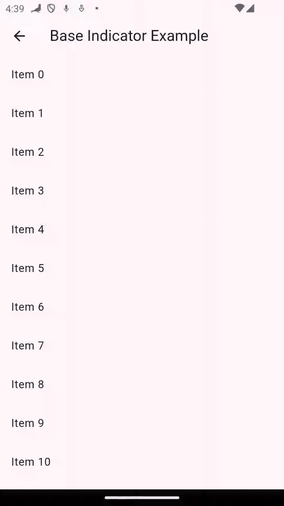
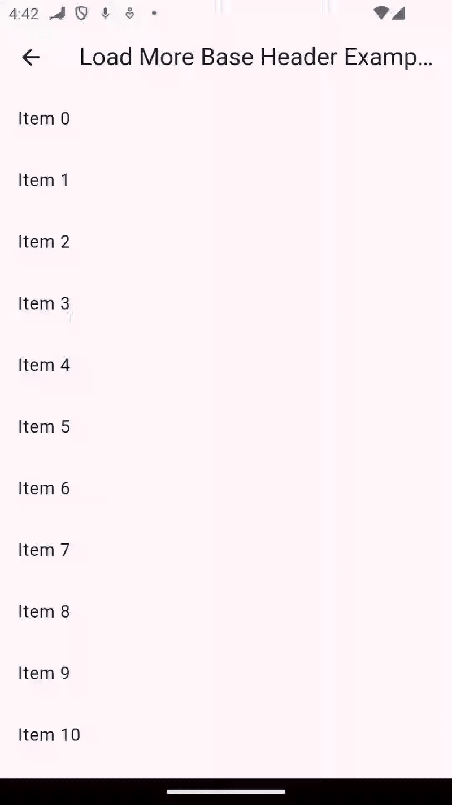
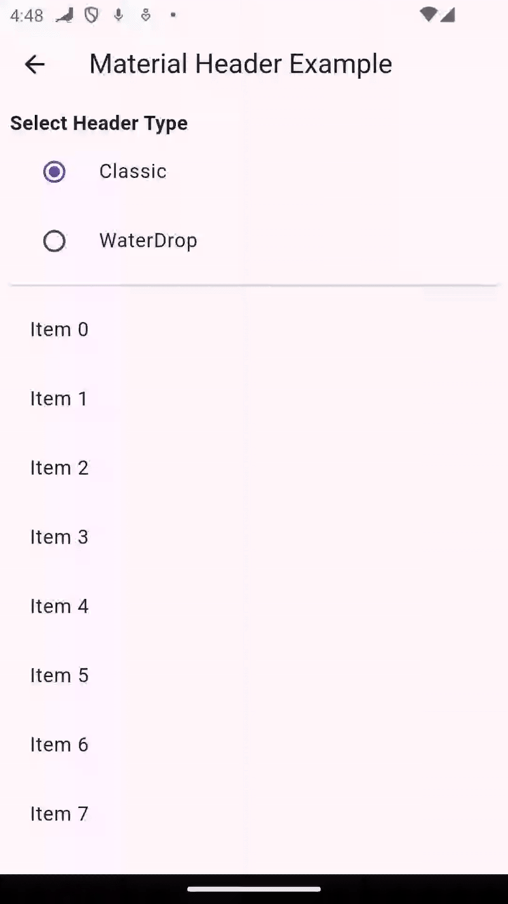
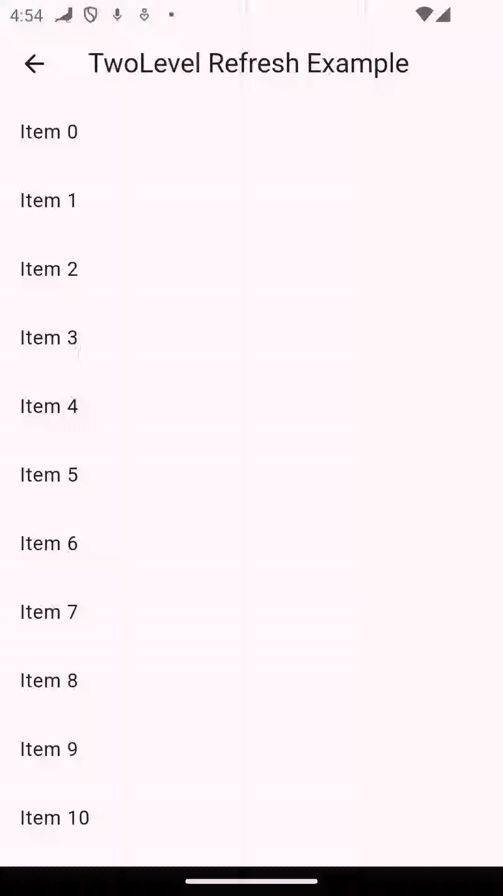

# Pullex 🚀

A modern, flexible and production-ready Pull-To-Refresh & Load-More widget for Flutter.  
Forked from [flutter_pulltorefresh](https://github.com/xxzj990-game/flutter_pulltorefresh) and updated for latest Flutter versions with improved architecture and localization.

---

## ✨ Features

✅ Modern architecture — compatible with Flutter 3.x+  
✅ Ready-to-use headers:
- BaseHeader
- CustomHeader
- MaterialClassicHeader
- WaterDropHeader
- StretchCircleHeader
- TwoLevelHeader

✅ Custom Footer support  
✅ LinkHeader / LinkFooter proxy support  
✅ Fully customizable  
✅ Easy to integrate  
✅ Localization with 14 languages built-in  
✅ Production ready — used in live apps  
✅ Zero dependencies (pure Dart)

---

## 📦 Installation

```yaml
dependencies:
  pullex: ^1.0.0
```

```dart
import 'package:pullex/pullex.dart';
```

---

## 🖼️ Examples

| Base Header | Custom Header | Load More Base Header | Material Header |
|-------------|---------------|----------------------|-----------------|
|  |  |  |  |

| Stretch Circle Header | Two Level Refresh | Water Drop Header |  |
|-----------------------|-------------------|-------------------|--|
|  |  |  |  |

---

## 🌍 Localization

Pullex supports 14 languages out of the box:

| Language | Code |
|----------|------|
| English  | en   |
| Chinese  | zh   |
| French   | fr   |
| Ukrainian| uk   |
| Italian  | it   |
| Japanese | ja   |
| German   | de   |
| Spanish  | es   |
| Dutch    | nl   |
| Swedish  | sv   |
| Portuguese (Brazil) | pt   |
| Korean   | ko   |

### Setup localization:

```dart
MaterialApp(
  localizationsDelegates: [
    RefreshLocalizations.delegate,
    GlobalMaterialLocalizations.delegate,
    GlobalWidgetsLocalizations.delegate,
    GlobalCupertinoLocalizations.delegate,
  ],
  supportedLocales: [
    const Locale('en'),
    const Locale('uk'),
    const Locale('fr'),
    const Locale('de'),
    const Locale('es'),
    const Locale('pt'),
    const Locale('it'),
    const Locale('nl'),
    const Locale('sv'),
    const Locale('ko'),
    const Locale('ja'),
    const Locale('zh'),
  ],
)
```

---

## 🚚 Migration from `flutter_pulltorefresh`

Pullex is a modern fork of `flutter_pulltorefresh`, fully compatible with Flutter 3.x+:

✅ Improved header/footer indicators  
✅ Updated internal scroll physics  
✅ API cleaned and simplified  
✅ Built-in localization  
✅ Actively maintained

---

## 📌 Example Project

You can find a complete example in:

```
example/lib/ui/
```

Each header type has a dedicated example:

```
ui/base_header/base_header_example.dart
ui/custom_header/custom_header_example.dart
ui/load_more_base_header/load_more_base_header_example.dart
ui/material_header/material_header_example.dart
ui/stretch_header/stretch_header_example.dart
ui/two_level_refresh/two_level_refresh_example.dart
ui/water_drop_header/water_drop_header_example.dart
```

Run:

```bash
flutter run -d your_device
```

---

## ❤️ Contributing

Contributions are welcome!  
Feel free to open issues or submit pull requests.

---

## 📜 License

MIT License — based on `flutter_pulltorefresh` by [Jpeng](https://github.com/xxzj990-game/flutter_pulltorefresh)

---

Pullex — Ready for modern Flutter 🚀
